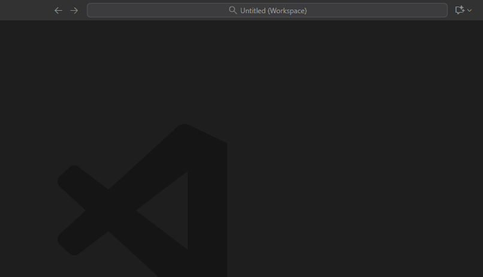

# nRFModule Development Manifest

This is the master configuration for the nRFModule Firmware Ecosystem. It orchestrates the Nordic SDK (NCS), Zephyr, and our private libraries into a single workspace.

## 1. Prerequisites

*   **VS Code** installed.
*   **nRF Connect for VS Code Extension Pack** installed.
*   **Git** installed and authenticated.

## 2. Setup (The Correct Way)

**⚠️ STOP! Do not clone `nrfmodule-core` manually.**

We use a **West Workspace** managed by the nRF Connect Extension. This ensures you have the correct version of the SDK, Zephyr, and our private libraries all linked together correctly.

### Step-by-Step Guide

1.  Open VS Code.
2.  Click on the **nRF Connect** icon in the sidebar (the Nordic logo).
3.  In the **Welcome** or **Manage SDKs** section, click **"Create new workspace"**.
4.  Select **"Copy from URL"** (or "Initialize from URL").
5.  Paste this URL:
    ```text
    https://github.com/nrfmodule/nrfmodule-dev-manifest
    ```
6.  Select a folder on your drive (e.g., `C:\nrfmodule_workspace`) and let it initialize. This will take a few minutes to download NCS and our libraries.



### Verifying the Setup

Once finished, open the folder in VS Code. You should see a folder structure like this:

```text
workspace/
├── .west/
├── nrf/                  <-- Nordic SDK (v3.x)
├── zephyr/               <-- Zephyr RTOS
├── modules/
│   └── lib/
│       ├── nrfmodule-core/  <-- PRIVATE SOURCE (Edit code here!)
│       └── nrfmodule-sdk/   <-- PUBLIC WRAPPER
└── ...
```

## 3. How to Develop (The Workflow)

**CRITICAL:** You are working *inside* the workspace. The folders `modules/lib/nrfmodule-core` are actual Git repositories.

### Step 1: Create a Feature Branch
1.  Go to the **Source Control** tab in VS Code.
2.  You will see multiple repositories listed (manifest, core, sdk, zephyr, nrf).
3.  Locate **`nrfmodule-core`** (or whichever repo you are editing).
4.  Create a new branch: `feature/my-new-feature`.


### Step 2: Test Your Changes
To run your code, you need an application.
*   **Quick Test:** Create a temporary app inside the workspace.
*   **Real Product:** Use the `nrfmodule-product-template` (see its README).

### Step 3: Push & Pull Request
1.  Commit your changes in VS Code.
2.  **Push** the branch to GitHub.
3.  Go to GitHub and open a **Pull Request (PR)** to `main`.
4.  **⛔ DO NOT PUSH DIRECTLY TO MAIN.**
    *   We are on the "Honor System". GitHub will not stop you, but you will break the CI for everyone.
    *   See [CONTRIBUTING.md](CONTRIBUTING.md) for the full protocol.

## 4. Repository Map

| Repository | Role | Description |
| :--- | :--- | :--- |
| **`nrfmodule-dev-manifest`** | **The Boss** | Defines the SDK version and dependencies. Hosts the Docker CI image. |
| **`nrfmodule-core`** | **The Brains** | Private C source code. This is where you do 99% of your work. |
| **`nrfmodule-sdk`** | **The Face** | Public headers and binary distribution. |
| **`nrfmodule-product-template`** | **The Body** | Reference application to run and test the code. |

## 5. CI/CD & Docker

This repository hosts the Docker image used by our CI pipelines.
*   **Image:** `ghcr.io/nrfmodule/nrfmodule-dev-manifest:latest`
*   **Trigger:** Modifying files in `infra/docker/` will trigger a rebuild of the image (takes ~15 mins).
